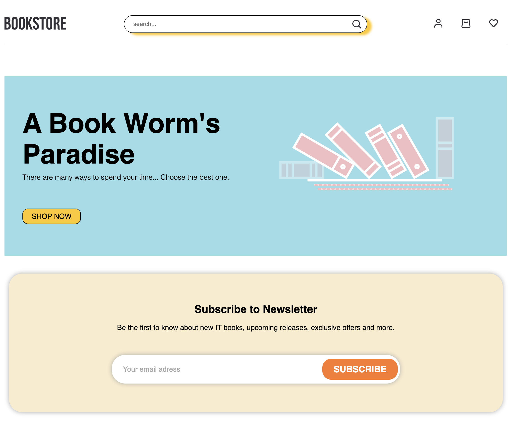

Btw, not all features are working,there are some problems with gh-pages. Trying to solve it:)

# BookStore

[Live Demo](https://aliaksandra-leanovich.github.io/react-bookstore/)

## About The Project

---

 

 

The project is web-site for buying programming books.
There is button "Shop Now" on home page which can redirect you to page with catalog of new releases books. You can view book`s details by clicking on card with necessary book. There is serch input in header using which you can search for necessary book by its name. Moreover, you can sign up and add to favorites and to your cart books which you want.

## Tools and Packages

---

- [React](https://reactjs.org/)
- [Redux Toolkit](https://redux-toolkit.js.org/)
- [Typescript](https://www.typescriptlang.org/)
- [Styled-Components](https://styled-components.com/)
- [React-Hook-Form](https://react-hook-form.com/)
- [React-Router-Dom](https://v5.reactrouter.com/web/guides/quick-start)
- [Axios](https://axios-http.com/docs/intro)
- [Firebase](https://firebase.google.com/)
- [React-Scroll](https://www.npmjs.com/package/react-scroll)
- [React-Spinners](https://www.npmjs.com/package/react-spinners)
